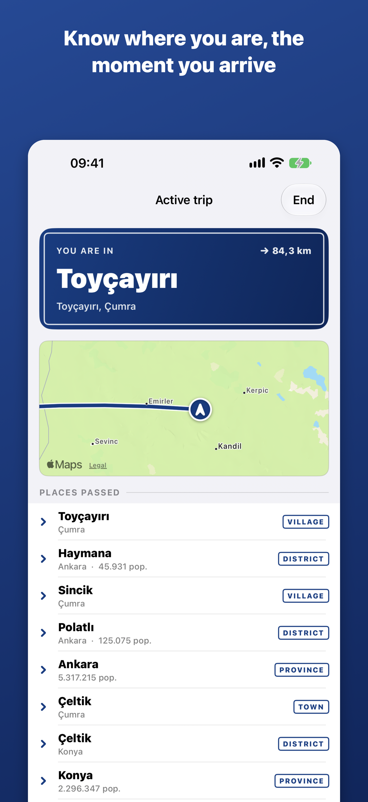
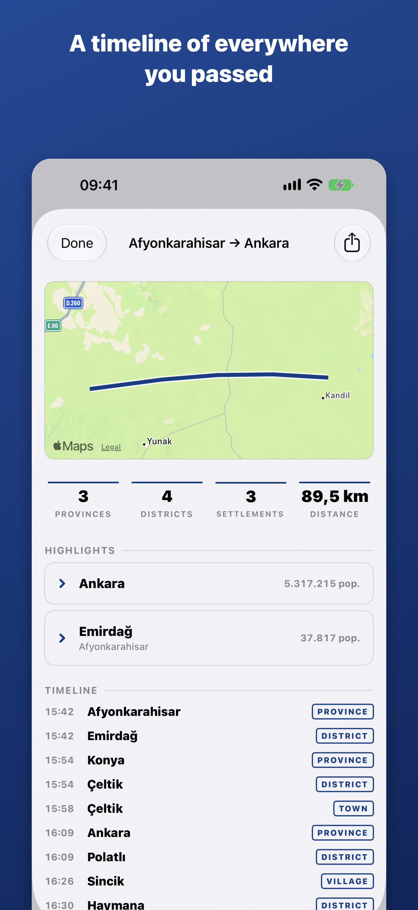
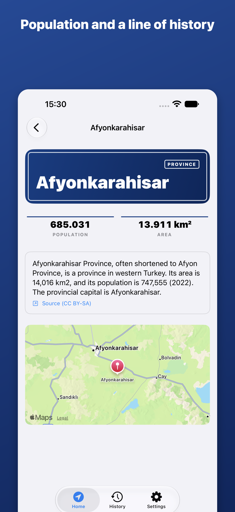
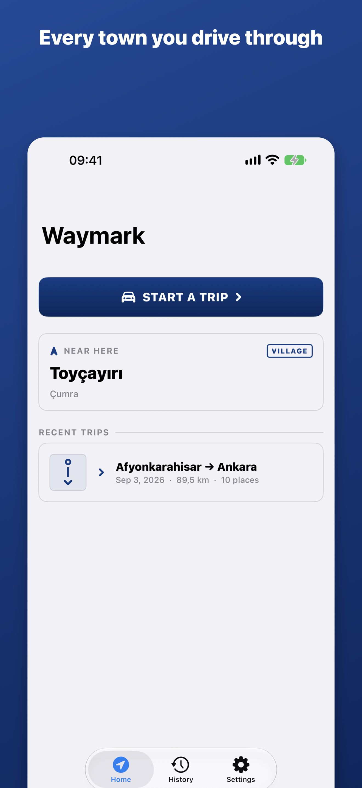

# Waymark

A quiet travel companion for intercity journeys in Turkey. The moment you cross
into a new province, district or town — by car, bus or bike — Waymark tells you
where you are: the name, the population, and a line of history, right on your
lock screen.

**Fully offline. No account, no server, no third‑party location SDK. Your
location never leaves the device.**

<p>
  
  
  
  
</p>

## What it does

- **Boundary detection, offline.** A polygon engine over an embedded ~8 MB SQLite
  pack (81 provinces, 970 districts, ~44,000 villages and towns) decides which
  administrative area you're in. No network for the core loop.
- **Notification‑light.** By default one alert per province and district — not
  forty villages. Quiet hours and a per‑place cooldown keep it calm.
- **Live Activity first.** Current place, the full `Mahalle, İlçe, Şehir`
  hierarchy, the province plate code, and a running count — on the lock screen
  and in the Dynamic Island.
- **Trip history & route map.** Every trip is saved on device with a route line
  and a timeline. Share a trip image with the start and end trimmed so your home
  isn't in the frame.
- **Starts on its own (optional).** An App Intent + a motion nudge
  (`CMMotionActivityManager`) so a trip can begin from a Shortcuts automation
  (car Bluetooth, CarPlay, "when Maps opens") or a gentle "you're on the road"
  reminder.

## Architecture

Swift 6, SwiftUI (`@Observable`), SwiftData, ActivityKit. iOS 26.0, built with
the iOS 27 SDK. SwiftUI‑native MVVM‑C.

| Module | Responsibility |
|---|---|
| `Packages/GeoData` | The pack: GRDB SQLite reader, polygon decoder + point‑in‑polygon (inner rings for enclaves), Haversine, `SQLiteGeoResolver` |
| `Packages/LocationEngine` | Sample filtering, the presence state machine (dwell / hysteresis / exit), GPX replay harness, the travel‑nudge policy |
| `Packages/TripKit` | Route recording (Douglas–Peucker simplify, segmentation), trip model + summary, `TripStore` (SwiftData) |
| `Packages/Presence` | Notification/Live‑Activity policy matrix, coalescer, gate (cooldown / rate limit / quiet hours), Turkish locative copy |
| `Packages/DesignSystem` | Road‑signage design language — `SignPanel`, `TierShield`, `PlateBadge`, `MilestoneRow`, tokens |
| `waymark/` | App target: DI root, navigation, 7 screens, `LiveTripController`, App Intents |
| `WaymarkWidgets/` | Live Activity — lock‑screen view + four Dynamic Island states |

The polygon binary format (`Packages/GeoData` `PolygonDecoder` ↔ the Python
`polygon.py` encoder) is a shared byte contract — the region pack is built once,
never fetched at runtime.

## The data pipeline

`tools/` is a region‑agnostic Python pipeline (`python3 -m tools.build_pack`)
that turns OpenStreetMap + Wikidata + Wikipedia into `tr.pack`. Nothing about
Turkey is hard‑coded — a new country is a new `tools/config/xx.toml`. See
[`tools/README.md`](tools/README.md).

Data sources: **OpenStreetMap** (ODbL), **Wikidata** & **Wikipedia** (CC BY‑SA
4.0, attributed in‑app on every place), population from Wikidata (TÜİK ADNKS is
the intended v1 source). Maps by Apple via MapKit.

## Build

```bash
# app + packages
open waymark.xcodeproj          # scheme: waymark, a modern iOS Simulator

# package tests (176 Swift Testing cases)
cd Packages/GeoData && swift test        # and LocationEngine / TripKit / Presence

# pipeline tests
cd tools && python3 -m venv .venv && source .venv/bin/activate
pip install -r requirements.txt && pytest tests -q
```

The real `tr.pack` is committed (`waymark/Resources/tr.pack`); the 600 MB OSM
extract it's built from is not (`tools/data/` is git‑ignored).

## Status

v1 feature‑complete and building for device (Debug + Release). Remaining before
submission: on‑device field test (battery, Live Activity, signal gaps — spec
§12.4) and the App Store upload itself. See [`docs/app-store.md`](docs/app-store.md).

Privacy policy and support: [`docs/privacy.md`](docs/privacy.md),
[`docs/support.md`](docs/support.md) (served via GitHub Pages).

## Licensing

Third‑party **data** carries its own terms — see *Data sources* above; the
attribution screen in the app and `docs/app-store.md §9` track them. The
application source has no open‑source license yet.
